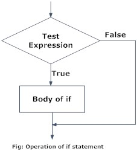

# Chapter 1: Introduction into Fundamentals in R

## 1. Welcome to this R Course

### 1.1 Let's start with a quick introduction round

-   Your Name
-   Your current study programme
-   Motivation for this course

### 1.2 Prerequisities

- `R` and RStudio 
- Access to Ilias 

### What is `R` and `RStudio`

`R` is a programming language specifically developed for statistical analysis. `RStudio` is a nice graphical interface to work with R. 

### 1.3 Why `R` ? 

+ Free of cost and open-source 
+ Functionalities for all steps of research process from Data Collection to
Data Analysis
+ Programming language specifically developed for statistical analysis 
+ Very active Community: 
 + e.g. `R` community on [StackOverflow] (https://stackoverflow.blog/2017/10/10/impressive-growth-r/)
 + e.g. *#rstats* on twitter

### 1.4 What expects you and what not 

In this course you will learn: 

+ To get familiar with `R` and its basic language 
+ Core commands from the tidyverse package 
+ Data Wrangling, Data Bridging, Data Munging, Data Manipulation 
+ An efficient Workflow 
+ A brief introduction into core Datasets of Political Science 

You will **not** learn: 

+ Data Analysis (QM and AQM) 
+ Advanced R usage (Webscraping, Quantitative Text Analysis etc...)  

### 1.5 Overview of the course structure: 

**1. The R environment** 

 + Basic Functionality (Calculations, Vectors, Matrices, Lists)
 + Object classes 
 + Accessing, Subsetting and Naming Objects
 
**2. Data Manipulation** 

 + Pipelines or Piping 
 + The tidyverse - Dplyr 
 + Loading and Storing Data 
 + Ordering your Data: Renaming, Re-Ordering, Subsetting and Selecting 
 + Transforming Variables 
 + Merging Data 
 + Missing Values 
 
**3. Exploratory Data Analysis/Descriptives** 

 + Summary Statistics - the Psych package 
 + Frequency Tables 
 + Cross-Tabulations, Correlation Matrice 
 
**4. Data Visualization** 

 + The Tidyverse - ggplot 2 
 + Constructing Plots 
 + Plotting anything 

**5. R Programming** 

 + For loops
 + Apply function 
 + Functions


## 2. Getting familiar with RStudio and establishing a Workflow 

### 2.1 The user interface 

RStudio has four main components and each of them has a purpose: 


+ **On the top left** you can see the **Source** window. In this window you write and run your code. The console opens after you choose, which type of Script you want to use: 

 + The standard **R Script** (`Ctrl + Shift + N`): In this file you can just write your code and run it. You can also make commenting lines with putting a `#` in front of it. 
 
 + The **R Markdown File**: In contrast to the standard **R Script** not everything written in a **R Markdown File** is automatically considered as Code (if not written after an `#`). A **R Markdown File** has options to design an HTML Output and a PDF Output. This can increase your efficiency in terms of working with partners. Further, you can write your code in **chunks** and have plenty options to work with those **chunks**.
 In QM and AQM you will exclusively use **R Markdown** and over time you will see the advantages of R Markdown.
 

+ **On the top right** you can see the **Environment**. Here you have an overview over all the objects currently loaded in your environment. You will learn more about objects later in the course.
 
+ **On the bottom left** you have the **Console**: This is where the results appear once you execute your R-code. You can also directly type R-code into the console and execute it. However, we cannot save this code which is why we usually work in the Editor.

+ **On the bottom right** you can see the **Output**: Plots (if you use the standard R Script) and other things will appear here, don't worry too much about it for the moment.


### 2.2 How to design it according to your preferences 

+ You can change the appearance of `RStudio`: `Tools > Global Options > Appearance`. Here you can change the zoom of the Console, the font size of the your letters and the style of your code. Further, you can change RStudio to a dark theme. Play around with it and find out how it is the most comfortable for you and of course you can change it over time.

+ You can change the **Pane Layout** meaning where the four components of RStudio should be: `RStudio`: `Tools > Global Options > Pane Layout`. 

+ You should use key shortcuts. There are pre-installed short-cuts of RStudio, which are really helpful. You should get familiar with them. `Tools > Key Shortcut Helps` or directly with `Ctrl + Shift + K`. You can add your own Key Shortcuts and we will do that in this course.  

### 2.3 R Projects 

+ A **R project** is a efficient way of storing your code, files and data. It makes it easier to work with others (especially when using GitHub). It makes things easier. When you open a file, you should always first open the **R project** and then in your **Output**, in **Files** your script. Also for cooperation it is advantageous, because **R projects** include everything necessary to replicate the R file. 


## 3. Lets get started: R as a fancy calculator 

### 3.1 Operations in R 

```{r}

#You can use hashtags to comment

1 + 1 #Addition

1 - 1 #Substraction

1 * 1 #Multiplication 

1 / 1 #Division

2^(1 / 2) #Mixed Terms

```

You can use R also for TRUE/FALSE statements for logical statements via the comparison operators

+ `>` greater than 
+ `<` smaller than 
+ `==` equal 
+ `!=` not equal
+ `>=` greater than or equal to
+ `<=` less than or equal to 

```{r}

1 < 3

5 >= 8

11 != 10

22 == 22

7 < 3

5 <= 2+3

```

You can also use logical operators: 

+ `&` element-wise AND operator. It returns TRUE if both elements are true 
+ `|` element-wise OR operator. It returns TRUE if one of the statements is TRUE
+ `!` Logical NOT operator. It returns FALSE if statement is TRUE

```{r}

5 & 4 < 8

5 | 4 < 8

!5 > 2

```

### 3.2 Using Commands 

For more advanced operations you can and should use commands. Commands are mostly a word with brackets, in which the information goes. 

e.g. 

+ `sqrt()` taking the square root 
+ `exp()` the constant e 
+ `mean()` for the mean
+ `median()` for the median 


```{r}

sqrt(36)

exp(0)

print("I am the best") #with this command you can print what you want 

#If you need help with a command you can use a question mark in front of the command or the help command

?exp()
help(exp)

```

### 3.3 Assigning objects and printing them

Most of the time you will store your results in objects. You can do so by using the `<-` operator. Afterwards you can work with the objects. 

```{r}

Pizza <- 7.50 

Cola <- 3.50 

Pizza + Cola

Offer <- Pizza + Cola 

Offer

Offer^2 #you square the term with ^2

#You can also create number intervals with setting a `:` between the two limits

interval <- 1:20

print(interval)

```
### 3.4 Vectors and Objects Classes 


#### 3.4.1 Vectors 

In R a vector contains more than one information. You use the `c()` command, and divide the information with a `,`. Let us compare food prices:


```{r}

food <- c("Pizza", "Kebab", "Asian", "Mensa", "Mexican")

print(food)

prices <- c(7.50, 6.00, 8.50, 3.00, 11.00)

print(prices)

cola_prices <- c(3.50, 3, 4, 2.50, 3)

print(cola_prices)

#We can now calculate the prices for a decent meal in the restaurants

prices_combined <- prices + cola_prices

print(prices_combined)

```

#### 3.4.2 Object Classes 

Objects can contain information of different *data types*:

|               |               |                                              |
|----------------|----------------|----------------------------------------|
| **Numeric**   | Numbers       | `c(1, 2.4, 3.14, 4)`                         |
| **Character** | Text          | `c("1", "blue", "fun", "monster")`           |
| **Logical**   | True or false | `c(TRUE, FALSE, TRUE, FALSE)`                |
| **Factor**    | Category      | `c("Strongly disagree", "Agree", "Neutral")` |


For data analysis commands sometimes require special object classes. With the `class()` command we can find out the class. And with `as.numeric` for example we can change classes by assigning it to itself, by it is common to assign it to a new object:


```{r}

#Let us find out the classes 

class(prices)
class(food)
class(cola_prices)


#We want the cola_prices vector to be a character 

cola_prices_character <- as.character(cola_prices)

class(cola_prices)
class(cola_prices_character)

```


### 3.5 Matrices 

There are different ways of building a matrix. Let us start by just binding the vectors as columns together. You can do that `cbind()` if you want to bind columns together. `rbind()` is therefore the command to bind rows together. 


```{r}

price_index <- cbind(food, 
                     prices,
                     cola_prices) #We bind it together

print(price_index) #We print it 

#Let's do the same by binding the rows together

price_index2 <- rbind(food, 
                     prices,
                     cola_prices) #We bind it together

print(price_index2) #We print it 


# We can also create directly a matrix 

matrix_example <- matrix(1:20, nrow = 4, ncol = 5, byrow = T) # create numeric matrix
print(matrix_example)

dim(matrix_example) #The dim() command shows you the dimensions of a matrix

#What happens if byrow is set to FALSE?

matrix_example2 <- matrix(1:20, nrow = 4, ncol = 5, byrow = F) # create numeric matrix
print(matrix_example2)

dim(matrix_example2) #The dim() command shows you the dimensions of a matrix


```

We want to work with matrices. You can extract columns and rows

```{r}

#Let us get used to work with objects

row <- 1 
column <- 1 

#The number before the comma in the square brackets refer to the row(s), and after the comma everything refers to the column. If you use both, you logically refer directly to a number

print(object1 <- matrix_example[row, ])
print(object2 <- matrix_example[, column])
print(object3 <- matrix_example[row, column])

print(matrix_example)

#More Information 

nrow(matrix_example) #How many rows

ncol(matrix_example) #How many columns

dim(matrix_example) #Overall dimensions
  

```


### 3.6 Data Frames 

Data Frames are more useful than matrices, since they are able to contain objects with different classes: 

```{r}

df_example <-
  data.frame(
    country = c("Austria", "England", "Brazil", "Germany"), 
    capital = c("Vienna", "London", "Brasília", "Berlin"), 
    elo = c(1761, 1938, 2166, 1988),
    logical = c(TRUE, FALSE, FALSE, TRUE)
  )

print(df_example)

#What if we want to inspect single variables? 

df_example$country #You tell R to use the data frame "df_Example" and with the dollar sign, you tell R to print a certain variable. 

```

## 4. The `ifelse()` function and `ifelse` conditions:

One of the most frequently used and therefore most important logical operators in programming in general are `ifelse` commands. You probably know them from Excel, but every programming language includes them, because of their usefulness. A quick reminder of their logic.

### 4.1 Simple if command 


This is the logic of a simple **if statement**. If a test expression is met, then the body of it (logical consequence) should happen

```{r}

grade <- 1.7 

if(grade < 2) {
  print("Good Job")
} # You write down if(test expression), and then the {body expression}, thus the body expression in fancy brackets.

grade <- 2.5 

if(grade2 < 2) {
  print("Good Job")
} #Since the condition is not met, nothing happens

```

### 4.2 ifelse command 

An if command on its own is quite useless, things get interesting, when we also have a body for the else command:


Now we just add a **body of else** into the equation, in R that means we need to define it

```{r}

grade <- 3.3

if (grade3 <= 2) {
  print("Good Job")
} else {
  print("Life goes on")
} #You add an else command and {Body expression else}, thus the body expression of else in fancy brackets 

grade <- 1.3 

if (grade <= 2) {
  print("Good Job")
} else {
  print("Life goes on")
}


```

What you see above is a classic ifelse condition, but R has a base R function called ifelse(), which does the same thing as the function above 

```{r}
ifelse(grade <=2, "Good Job", "Life goes on") #The command is called ifelse() ==> ifelse(test expression, body expression if, body expression else). It does not look so fancy as the if else condition tho 
```


### 4.3 if else ladders/ if else with multiple conditions

Of course not every operations requires a dichotomous operation, so what we need are if else commands with multiple conditions: 

```{r}

grade <- 1.0 

if (grade == 1.0) {
  print("Amazing") 
} else if (grade > 1.0 & grade <= 2.0) {
  print("Good Job")
} else if (grade > 2.0 & grade <= 3.0) {
  print("OK")
} else if (grade > 3.0 & grade <= 4.0) {
  print("Life goes on")
} #You just need to add another if function into the body expression of the first else body expression: 

# if (test expression) { body expression if } else if(test expression 2) { body expression if} etc...

  
grade <- 2.7

if (grade == 1.0) {
  print("Amazing") 
} else if (grade > 1.0 & grade <= 2.0) {
  print("Good Job")
} else if (grade > 2.0 & grade <= 3.0) {
  print("OK")
} else if (grade > 3.0 & grade <= 4.0) {
  print("Life goes on")
} 

grade <- 3.3

if (grade == 1.0) {
  print("Amazing") 
} else if (grade > 1.0 & grade <= 2.0) {
  print("Good Job")
} else if (grade > 2.0 & grade <= 3.0) {
  print("OK")
} else if (grade > 3.0 & grade <= 4.0) {
  print("Life goes on") 
}

```
Again we can do so-called **nested ifelse function**, using the `ifelse` command:

```{r}

grade <- 1.7

ifelse(grade == 1.0, "Amazing", 
       ifelse(grade > 1 & grade <= 2, "Good Job", 
              ifelse(grade > 2 & grade <= 3, "OK", 
                     ifelse(grade < 3, grade <=4, "Life goes on"))))

grade <- 3.3 

ifelse(grade == 1.0, "Amazing", 
       ifelse(grade > 1 & grade <= 2, "Good Job", 
              ifelse(grade > 2 & grade <= 3, "OK", 
                     ifelse(grade < 3, grade <=4, "Life goes on"))))

# The same logic: ifelse(test expression, body expression if, ifelse(test expression 2, body expression if 2)) etc..

```


## Exercise Section: 

### Exercise 1: Create a vector called `my_vector` with the values 1,2,3 and check is classe.

```{r}


```

### Exercise 2: Create a Matrix called `student`. This should contain information about the `name`, `age` and `major`. Make three vectors and bind them together to a the matrix `student`. Print the matrix. 

```{r}


```

### Exercise 3: Write an if-else statement that checks if a given number is positive or negative. If the number is positive, print "Number is positive", otherwise print "Number is negative". Feel free to decide if you want to use the ifelse function or the ifelse condition.

```{r}

#Assigning the number to the object "number"
number <- -4


```


### Exercise 4: Write an if-else ladder that categorizes a student's grade based on their score. The grading criteria are as follows:

Score >= 90: "A"
Score >= 80 and < 90: "B"
Score >= 70 and < 80: "C"
Score >= 60 and < 70: "D"
Score < 60: "F"

```{r}

```


