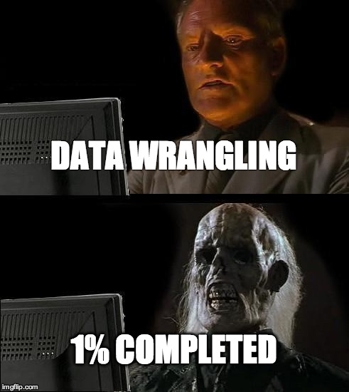

# Chapter 2: Data Manipulation

## 1. Packages 

This far, we've only covered so-called "base R functions" or "built-in 
functions", but R has an active community and sometimes further operations are 
needed, so we use **packages**. These are including further functions, which we 
will use heavily in the following section. 

### 1.1 The `tidyverse` package 

One of the most influential and widely used package in R is the `tidyverse` 
package. This package includes several other packages, which are key for data 
manipulation e.g. `dplyr`, `ggplot2`, `stringr`, `readr`, `tidyr`. 


## 2. Working with packages 

### 2.1 Installing packages

To install packages you use the very creative `install.packages()` command in R.
Note that it is necessary to directly install a package in R. This step is only 
required once. 

```{r, eval=FALSE}

install.packages("tidyverse") #You need to put the name of the package into quotation marks 
install.packages("haven") #This is a package which helps to read different types of data into R 


```


### 2.2 Loading your packages 

While you only need to install a package once, you need to load it every time in your script, when you open it. You can do that with the `library()` function in R: 

```{r}

library(tidyverse) #You run the code and voila you can use the package
library(haven) #Remember that you do not need quotation marks in this command 

```

It is always important to have an efficient workflow in R. Traditional R users, load all packages they need at the beginning of their page. Logically, so they just need to go back to the top of the script and need to load it every time they open the script. But there are way more elegant and pragmatic ways to do that.

One way is the `pacman` package: 

```{r}

pacman::p_load("tidyverse", "haven", "psych", "WDI", "OECD", "gapminder") 

# First, if you use the name of package and put a "::" behind it you tell R to go into the package and to specifically get one command of the package, in our case the `p_load` command. 

#Second, the p_load command, loads the packages in the brackets and checks if they are installed, if not, it automatically installs and loads them. 

```

Remember what I said earlier, if you use only base R functions than you make your life harder, and here is an example: 

```{r setup}
# The first line sets an option for the final document that can be produced from
# the .Rmd file. Don't worry about it.
knitr::opts_chunk$set(
  echo = TRUE, # show results
  collapse = TRUE # not interrupt chunks
)

# The next bit (lines 56-75) is quite powerful and useful.
# First you define which packages you need for your analysis and assign it to
# the p_needed object.
p_needed <-
  c("tidyverse","haven", "psych", "WDI","gapminder")

# Now you check which packages are already installed on your computer.
# The function installed.packages() returns a vector with all the installed
# packages.
packages <- rownames(installed.packages())
# Then you check which of the packages you need are not installed on your
# computer yet. Essentially you compare the vector p_needed with the vector
# packages. The result of this comparison is assigned to p_to_install.
p_to_install <- p_needed[!(p_needed %in% packages)]
# If at least one element is in p_to_install you then install those missing
# packages.
if (length(p_to_install) > 0) {
  install.packages(p_to_install)
}
# Now that all packages are installed on the computer, you can load them for
# this project. Additionally the expression returns whether the packages were
# successfully loaded.
sapply(p_needed, require, character.only = TRUE)
```

This code is used in your QM class, don't worry about it, it does the same as the `pacman` package with some fancy extras. You just need to write the packages you need into the brackets of line 80. The good news: At the end of this course, you will understand the logic of this code. 


## 3. Loading Data 

### 3.1 Data types

The last step, before starting data manipulation is to read data into R. There are different types of data structures, I will present you the most frequent ones and the codes to read them in: 

|File           |File Extension |Command                                     |
|---------------|---------------|----------------------------------------------|
| **Stata**     | .dta          | `read.dta13()`, `read_dta()`                 |
| **CSV-Files** | .csv          | `read_csv()`                                 |
| **RData**     | .RData;.rds   | `load()` , `read.rds()`                      |


### 3.2 The European Social Survey

For the following Data Manipulation Part, we will use the European Social Survey Round 10 with the topic "Democracy, Digital social contacts". It is a high-quality survey conducted in 31 European countries. Round 10 was conducted in 2020 and is the most recent ESS. We will use it, since survey data is quite popular among students and further at some point everyone needs to work with it. But do not worry if you do not like survey data, we will also cover other prominent Datasets. 

You can freely download it via the [website](https://www.europeansocialsurvey.org/) of the ESS. From there you need to go to the Data Portal and than you can download the Round you want, in the format you want. As already mentioned, use the `.dta` or `.csv` format. 


## 4. Let's wrangle the data 



### 4.1 Load the data

```{r}

d1 <- read.csv("data/ESS10.csv") #If it is not in the same direction than the R-Project, you should specify the the so-called path. Put the path in quotation marks and assign it to an object to work with it easier.

#This could take some time, since the dataset is huge 

#You can see the loaded Dataset "d1" in the Environment 

```


### 4.2 One last thing: Pipelines 

Sometimes codes have several dimensions, which could make it quite complicated 


`leave_house(get_dressed(get_out_of_the_bed(wake_up(me))))`


Well, as you can see there are too many dimensions and with tidyverse you can basically split it up into so-called **Pipelines**, for them you use a **Pipe** `%>%` : 

`me %>%`
    `wake_up() %>%`
    `get_out_of_the_bed() %>%`
    `get_dressed() %>%`
    `leave_house` 
    
It is the same code, in R this code would do the same. But the advantage is that it is way more intuitive. 

A real example: 


```{r}

q <- c(6,3,8)

sqrt(exp(mean(q)))

#With a Pipe 

q %>% 
  mean() %>%
  exp() %>%
  sqrt()

```


## 5. Dplyr 

Dplyr is the standard package, when it comes to data manipulation. It has 5 essential functions, and helpful further functions, even with the 5 essential ones, you are already able to work wit datasets extensively. 

### 5.1 The `filter()` command

If we want to filter our dataset for certain conditions, the `filter()` command is what we need: 

```{r, eval = FALSE}

#================================#
#Filtering for only one condition 
#================================#

d2 <- d1 %>% #Our dataset 
  filter(cntry == "HU") #filtering for cases only in Hungary. They use the iso2c code, thus two latters as a shortage. We assign it to a new object called d2 

head(d2) #Lets have a look if everything worked out 

d2 <- d1 %>%  
  filter(agea <= 40) #We only want participants younger than 40

head(d2) #Lets have a look if everything worked out


#================================#
#Filtering for multiple condition 
#================================#

d2 <- d1 %>% #Our dataset 
  filter(cntry %in% c("HU", "FR")) #filtering for cases in Hungary and France.

head(d2) #Lets have a look if everything worked out 

d2 <- d1 %>% #Our dataset 
  filter(cntry %in% c("HU", "FR") &
           agea <= 40) #filtering for cases under 40 in Hungary and France.

 #Lets have a look if everything worked out 

head(d2)

d2 <- d1 %>% #Our dataset
  filter(cntry %in% c("HU", "FR"), 
           agea <= 40) #filtering for cases under 40 in Hungary and France with a comma

head(d2)

```


### 5.2 The `select()` function: 

We obviously do not care about all variables a dataset can offer (mostly). To select the variables we need, we can use the `select()` function. This of course depends on our research question. Let's say we want to investigate if respondents (dis)trusting scientist are more likely to be willing to get vaccined against COVID-19. We want to control for Age, Education, Gender, and the Left-Right Position. 
 
```{r}

d2 <- d1 %>%
   select(trstsci, getnvc19, agea, eisced, gndr, lrscale) #Let's get the for us relevant variables

head(d3) #always check

#Of course we can combine the commands 

d2 <- d1 %>%
  filter(agea < 40) %>%
  select(trstsci, getnvc19, agea, eisced, gndr, lrscale)

head(d2)

#We can also delete columns from dataset, lets take the d6 and delete `lrscale`

head(d2)

d2 <- d3 %>% 
  select(-lrscale) #We delete columns by simply putting a comma before it


head(d2)


```


### 5.3 The `arrange()` function 

If we want our data to be in a certain order, we arrange it with this function.


```{r}

#Let us take the code for d7 as example again 

d2 <- d1 %>%
  filter(agea < 40) %>%
  select(trstsci, getnvc19, agea, eisced, gndr, lrscale) %>% 
  arrange(agea) #We just use the agea function and then R sorts the variable from the lowest to the highest 

head(d2)

#What if we want to have it from the highest to the lowest? 

#Let us take the code for d7 as example again 

d2 <- d1 %>%
  filter(agea < 40) %>%
  select(trstsci, getnvc19, agea, eisced, gndr, lrscale) %>% 
  arrange(desc(agea))#We just use the desc() function in the arrange finction and R sorts the variable from the lowest to the highest 

head(d2)

```

### 5.4 The `rename()` and `relocate()` function 

Two functions to make our dataset structured more useful are `rename()` `relocate()`, well they do what they basically named after: 

```{r}
#we again take d7s code 

d2 <- d1 %>%
  filter(agea < 40) %>%
  select(trstsci, getnvc19, agea, eisced, gndr, lrscale) %>% 
  arrange(desc(agea)) %>%
  rename(get_vac = getnvc19, 
         age = agea, 
         education = eisced, 
         female = gndr) #First you put the new name, equal sign and then you put the old name of the variable 

head(d2)

#===============================#

d2 <- d1 %>%
  filter(agea < 40) %>%
  select(trstsci, getnvc19, agea, eisced, gndr, lrscale) %>% 
  arrange(desc(agea)) %>%
  rename(get_vac = getnvc19, 
         age = agea, 
         education = eisced, 
         female = gndr) %>% 
  relocate(lrscale, age, education, female, get_vac, trstsci) #determine the order

head(d2)


# We can also specifically determine where we want to have the variable 

d2 <- d1 %>%
  filter(agea < 40) %>%
  select(trstsci, getnvc19, agea, eisced, gndr, lrscale) %>% 
  arrange(desc(agea)) %>%
  rename(get_vac = getnvc19, 
         age = agea, 
         education = eisced, 
         female = gndr) %>% 
  relocate(lrscale, .after = age) #after with a point in front of it puts the variable after age

head(d2)


d2 <- d1 %>%
  filter(agea < 40) %>%
  select(trstsci, getnvc19, agea, eisced, gndr, lrscale) %>% 
  arrange(desc(agea)) %>%
  rename(get_vac = getnvc19, 
         age = agea, 
         education = eisced, 
         female = gndr) %>% 
  relocate(lrscale, .before = age) #before with a point in front of it puts the variable before age

head(d2)


```


### 5.5 The `mutate` function 

Our next function helps us to calculate new variables and transoform variables in a calculative manner 

```{r}

d2 <- d1 %>%
  mutate(trstsci_10 = trstsci*10) #You use the mutate function by first declaring a new variable name, in our case trstsci_10 and then you write down your operation. 

head(d2)

#We can also combine two or more variables to create another variable and we can change the class of a variable

d2 <- d1 %>% 
  mutate(new_variable = trstsci*10/lrscale+67, 
         gndr_char = as.character(gndr))

head(d2)

```

#### 5.5.1 Recoding with `mutate()` using `recode()` 


```{r}

#The recode() function can be used to convert a variable, this is particulary useful, if we have an empirical strategy, which requires that or if we want to make new variables with new classes out of it: 

d2 <- d1 %>% 
  mutate(
    gndr_fac = as.factor(gndr), #always check the class 
    lr_cat = recode(lrscale,
                    `0` = 0,
                    `1` = 0,
                    `2` = 0,
                    `3` = 0,
                    `4` = 0,
                    `5` = 1,
                    `6` = 2,
                    `7` = 2,
                    `8` = 2,
                    `9` = 2,
                   `10` = 2,
                   `77` = NA_real_, 
                   `88` = NA_real_,
                   `99` = NA_real_),
    gender = recode(gndr_fac, 
                    `1` = "Male", 
                    `2` = "Female"))

#first you tell R, what variable needs to be recoded, and then you can change the scaling by using the original scaling in single quotation marks and after the equal sign, you can put numeric values straight in and character values in double quotation marks.

#Let us check how it worked out 

table(d2$lr_cat)
table(d2$gender)

```

#### 5.5.2 Recoding with `mutate()` using `case_when()` 

As you see, the `recode()` command is quite extensive. The **tidyverse** offers a way more intuitive command, the `case_when()` function: 

```{r}

d2 <- d1 %>% 
  mutate(gndr = as.factor(gndr),
    lr_cat = case_when(
    lrscale < 5 ~ 0,
    lrscale == 5 ~ 1,
    lrscale > 5 ~ 2),
    gender = case_when(
    gndr == 1 ~ "Male",
    gndr == 2 ~ "Female"
    ))

#Case_when works like a generalized ifelse function, you use case_when(), decide a condition for the variable, and with a wave you decide for the new value, which you put into brackets

#Do not get confused with the brackets, I always do...

table(d2$gender)
table(d2$lr_cat)

```

#### 5.5.3 Recoding with `mutate()` using `ifelse()` 

Do you remember the `ifelse()` function? As already mentioned, the `case_when()` command is a generalized `ifelse()` function. If you want to keep it old school, we can also recode with the `ifelse()` function: 

```{r}

d2 <- d1 %>% 
  mutate(gndr = as.factor(gndr),
         lr_cat = ifelse(lrscale < 5, 0, 
                            ifelse(lrscale == 5, 1, 
                                   ifelse(lrscale > 5, 2, NA
                                          ))),
         gender = ifelse(gndr == 1, "Male",
                         ifelse(gndr == 2, "Female", NA))
  )

#Check 

table(d2$lr_cat)
table(d2$gender)


```


## 6. Handling Missing Values/Incomplete Data 

As you saw right now, not all data in a dataset is complete. Of course not, there are several sources, which can lead to incomplete/missing data. Which means we need to deal with it directly. If we look into the codebook, the ESS declares different types of missing values with high numbers: 77 means "Refusal", so the respondent refused to answer, 88 means "dont know", and 99 "No answer". Note that the ESS does so, since some researchers are interested in missing values, and why they happen, so they can investigate it. 

For us, this is a problem, because we cannot run an analysis with missing values. There are two options: 

+ Using statistics to artificially fill them out, this called multiple imputation techniques, you will learn that in AQM. 

+ Just delete incomplete observations to have a dataset without missing values

We will do the second one, and I already showed how to recode useless values to NAs so this should be clear by now. Remember, the `ifelse()` und `recode` explicitly need input to turn values into NAs.


```{r}
#For that we take our dataset d1 

d1 <- d1 %>% 
  drop_na() #The command drop_na() drops all missing rows with missing values. The base R command is na.omit() and does the same.

d1 <- na.omit(d1) 

```


Now we have all ingredients to make our dataset. Do you remember our research question? We want to find out if people, who tend to not trust science are less willing to get vaccinated. We want to do that for all people over 35. 

```{r}

d2 <- d1 %>%
  filter(agea >=40) %>% #filtering for bigger equal 40 years old
  select(trstsci, getnvc19, agea, eisced, gndr, lrscale) %>% #selecting only relevant variables 
  arrange(desc(agea)) %>% #arranging them by age in a descending order 
  rename(no_vac = getnvc19, #renaming variables with unitutive names 
         age = agea, 
         education = eisced, 
         female = gndr) %>% 
  mutate( #Coding the missing categories into acutal missing values 
    no_vac = case_when( 
      no_vac == 1 ~ 0, 
      no_vac == 2 ~ 1, 
      TRUE ~ no_vac),
    trstsci = case_when(
      trstsci %in% c(77, 88, 99) ~ NA_real_, 
      TRUE ~ trstsci), 
    age = case_when(
      age == 999 ~ NA_real_,
      TRUE ~ age), 
    education = case_when(
      education %in% c(55, 77, 88, 99) ~ NA_real_,
      TRUE ~ education), 
    female = case_when(
      female == 1 ~ 0, 
      female == 2 ~ 1, 
      female == 9 ~ NA_real_, 
      TRUE ~ female),
    lrscale = case_when(
      lrscale %in% c(77, 88, 99) ~ NA_real_,
      TRUE ~ lrscale)
    ) %>% 
  drop_na() #dropping all rows with NAs

head(d2)

```


## 7. Merging Datasets 

Sometimes it could be the case that you need variables, which are not in one dataset *a priori* available, but in another dataset. For this case you load both datasets and **merge** them together. **This only works if there is a similiar data structure, so know your data !**

As an example, I will show how to do that with **World Bank Data**. From this data we can gather nearly all important economic indicators. But mostly we need to merge them to datasets we are interested in. We will merge the **World Bank Data** with the **KOF Globalization Index**. The **KOF Globalization Index** isone of the most prominent Globalization Indicies, and highly influential. It measures Globalization on different dimensions and differantiates between *de facto* and *de jure* Globalization. Let's check out the corresponding article from Gygli et al. 2019. 


There are several ways of getting World Bank Data, but I will show the most efficient. There is the package `WDI` with which you can get data through an API (Application Programming Interface). Long story, short we do not need to download anything and get the data directly: 

First we define, which countries should be included.
```{r}

countries <- c("HU", "FR", "DE", "US")

```

Afterwards we define, which variables we want. You do that by using the official indicator, thus the variable you want. You can find the indicators on the website of the [world bank data](https://data.worldbank.org/indicator). Click on the variables you want, then click on the details, and there you find the indicator. I will use GDP per capita, Fuel exports, CO2 emissions (kt). 

```{r}

indicators = c("NY.GDP.PCAP.CD", "TX.VAL.FUEL.ZS.UN", "EN.ATM.CO2E.KT")

```


Now we are ready to use the API. 

```{r}


wb <- WDI( 
  country = countries, #We include our countries 
  indicator = indicators, #We include our variables 
  start = 1960, #start date 
  end = 2023) #end date 

#This takes some time, especially if you have more countries and indicators.

head(wb) #We get the countryname, the iso codes and our variables 

```

Let us get started with the merging process, we need the KOF Globalization Index data 

```{r}

kof <- read_dta("data/KOFGI_2022_public.dta")

head(kof)

glimpse(kof) #A nice function from dplyr

skimr::skim_without_charts(kof) #The skimr package also helps

```

Since we do not need all variables we select the relevant ones. For us it is country, year, and the KOF globalization Index. 

```{r}

kof <- kof %>%
  select(code, country, year, KOFGI)

```

To merge data there are important functions from the **dplyr** package: The `left_join()` and the `right_join()` function. 

+ `left_join()`: You want to keep all observations in the first table, including matching observations in the second table. You merging the data from the right table to left table. 

+ `right_join()`: You want to keep all observations in the second table, including matching observations in the first table. You join from the left table to the left table. 

Well, in the end of the day it is a matter of programming socialisation and taste, which one do you prefer. I will show you both. 

To merge two datasets, you need at least one common variable. But most of the time you need two common identifiers. Since the datasets are structured by country and year, we will use country and year. Since there is only one country and year combination. We want the KOF Globalization Index assigned to a country X to a year Y: 

```{r}

#We want to merge into the World Bank Dataset 

merged_data <- left_join(wb, kof, by = c("iso3c" = "code", 
                                         "year" = "year")) #You define your first/left table, and then the second/right table comes next. Afterwards you define the common identifiers. 

head(merged_data) #Now we need to clean the dataset, but that will be your job...


#================#
#===right_join===#
#================#


merged_data2 <- right_join(kof, wb, by = c("code" = "iso3c", 
                                           "year" = "year"))

head(merged_data2)

```


## Exercise Section: 

### Exercise 1: Let's wrangle kid 

You are interested in discrimination and the perception of the judicial. More specifically, you want to know if people, who fell discriminated evaluate courts differently. Below you see a table with all variables you want to include in your analysis: 

| **Variable**  | **Description**                                 |
|---------------|-------------------------------------------------|
| **cntry**     | Country of respondent                           |
| **dscrgrp**   | Member of group discriminated against in country|
| **cttresa**   | The courts treat everyone the same              |
| **agea**      | Age                                             |
| **gndr**      | Gender                                          |
| **eisced**    | Highest level of education                      |
| **lrscale**   | Left_Right Placement                            |
|---------------|-------------------------------------------------|

a. Wrangle the data, and assign it to an object called **ess**. 
b. Select the variables you need
c. Filter for Austria, Belgium, Denmark, Georgia, Iceland and the Russian Federation 
d. Have a look at the codebook and code all irrelevant values as missing. If you have binary variables recode them from 1, 2 to 0 to 1  
e. You want to build an extremism variable: You do so by subtracting 5 from the from the variable and squaring it afterwards. Call it extremism 
f. Rename the variables to more intuitive names, don't forget to name binary varaibles after the category which is on 1
g. drop all missing values 
h. Check out your new dataset 

```{r, eval=FALSE}

ess <- 

```


### Exercise 2: Merging Datasets 

The `gapminder` package in R loads automatically the gapminder dataset. gapminder is an independent educational non-profit fighting global misconceptions, check out their website: https://www.gapminder.org/
The gapminder dataset is already loaded. 

a. Get an overview of the gapminder dataset. There are different ways to do so, you can choose by yourself

```{r, eval=FALSE}


```

b. We already loaded World Bank Data in the object **wb**. Merge the two datasets! Use `left_join()` and merge the gapminder dataset into the World Bank data. Define a new object called mer_df

```{r}

#Check the structure of the dataset
head(wb)

```


